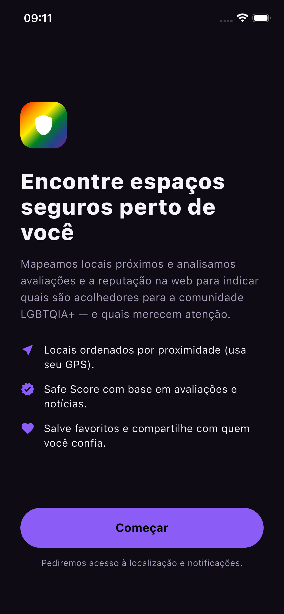
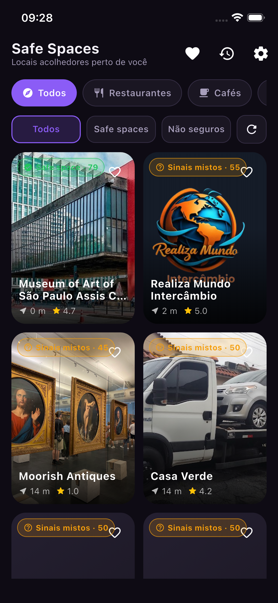
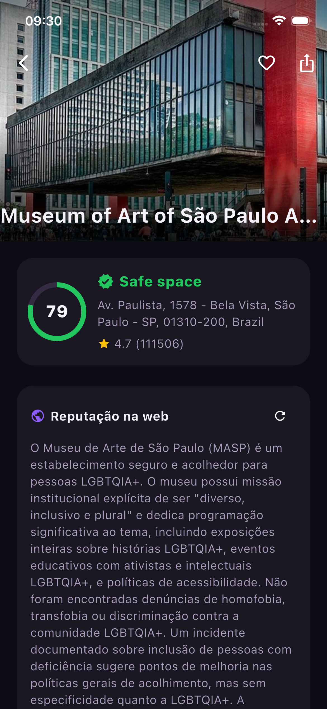
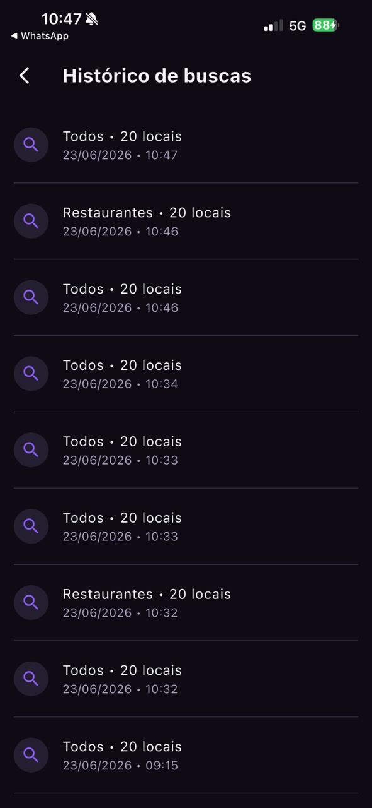
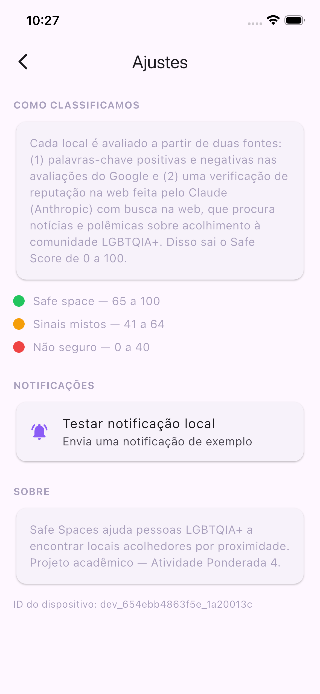

# 🏳️‍🌈 Safe Spaces — *Where to find safe spaces*

Aplicativo móvel (Flutter / iOS) que ajuda pessoas **LGBTQIA+** a descobrir, **por proximidade**, quais estabelecimentos próximos são **acolhedores e seguros** — e quais merecem atenção.

> **Atividade Ponderada 4** — aplicação mobile completa, com backend, banco de dados, consumo de API externa, sistema de notificações, compartilhamento nativo e uso de hardware do dispositivo.

---

## Sumário

- [Introdução](#1-introdução)
- [Desenvolvimento](#2-desenvolvimento)
  - [2.1. Visão geral e fluxo principal](#21-visão-geral-e-fluxo-principal)
  - [2.2. As telas da aplicação](#22-as-telas-da-aplicação)
  - [2.3. O hardware: GPS e localização](#23-o-hardware-gps-e-localização)
  - [2.4. As APIs externas: Google Places e Claude](#24-as-apis-externas-google-places-e-claude)
  - [2.5. O backend e o banco de dados](#25-o-backend-e-o-banco-de-dados)
  - [2.6. O sistema de notificações](#26-o-sistema-de-notificações)
  - [2.7. O compartilhamento nativo](#27-o-compartilhamento-nativo)
  - [2.8. Tratamento de erros, carregamentos e estados vazios](#28-tratamento-de-erros-carregamentos-e-estados-vazios)
- [Arquitetura](#3-arquitetura)
- [Tecnologias](#4-tecnologias)
- [Checklist da atividade](#5-checklist-da-atividade)
- [Como executar](#6-como-executar)
- [A jornada de construção](#7-a-jornada-de-construção)
- [Conclusão](#8-conclusão)

---

## 1. Introdução

A Atividade Ponderada 4 pede o desenvolvimento de uma **aplicação móvel funcional** que resolva um problema real de um público-alvo definido. A proposta do professor é explícita ao exigir que a solução não seja apenas um web app responsivo, mas um aplicativo mobile de verdade, construído em Kotlin, SwiftUI, Flutter ou tecnologia equivalente. Mais do que isso, ela pede uma aplicação **completa**: com múltiplas telas e navegação entre elas, backend próprio, banco de dados para persistência, consumo de pelo menos uma API externa que agregue valor à proposta, sistema de notificações integrado a uma situação real de uso, recurso de compartilhamento usando os mecanismos nativos do sistema operacional e uso de pelo menos um hardware do aparelho — câmera, GPS, acelerômetro, biometria ou outro sensor. O ponto central do enunciado é a **coerência**: não basta empilhar funcionalidades, é preciso que o problema escolhido, as features desenvolvidas e os recursos mobile utilizados façam sentido juntos.

Foi a partir dessa exigência de coerência que escolhemos o problema. Pessoas LGBTQIA+ convivem com uma insegurança cotidiana que a maioria das pessoas nunca precisa pensar: antes de entrar em um restaurante, um bar, uma academia ou uma loja, não há como saber se aquele lugar é acolhedor ou se já foi palco de episódios de homofobia ou transfobia. Essa informação até existe — está espalhada em avaliações do Google, em notícias, em posts de redes sociais —, mas ninguém vai ler tudo isso de pé, na calçada, decidindo onde entrar. O resultado é que a escolha de um espaço público, que para muita gente é trivial, para essa população carrega um cálculo de risco silencioso.

O **Safe Spaces** existe para resolver exatamente esse problema. Ele usa o **GPS do celular** para encontrar os locais mais próximos do usuário e, para cada um, calcula um **Safe Score de 0 a 100** acompanhado de um selo visual — *Safe*, *Sinais mistos* ou *Não seguro*. Esse score nasce de duas fontes complementares: a análise de **palavras-chave** (positivas e negativas, em português e inglês) nas avaliações do Google e uma **verificação de reputação na web** feita pela IA da Anthropic, o **Claude**, usando a ferramenta de busca na web para encontrar notícias e polêmicas envolvendo acolhimento à comunidade LGBTQIA+. A escolha do problema é, portanto, indissociável dos recursos mobile usados: a localização não é um enfeite, é o que torna a resposta *imediata e relevante para onde a pessoa está agora*; as notificações avisam quando há um espaço seguro por perto; o compartilhamento permite recomendar um lugar acolhedor para quem se confia.

Esta documentação tem duas funções. A primeira é técnica e descritiva: explicar o que o app faz, como está arquitetado, quais tecnologias usa e como rodá-lo. A segunda é narrativa: registrar a trajetória de construção — as decisões, os erros que só apareceram ao rodar e as escolhas feitas para que a solução ficasse coerente com o problema. As telas reais do aplicativo, capturadas em execução no simulador iOS, aparecem ao longo do texto.

---

## 2. Desenvolvimento

### 2.1. Visão geral e fluxo principal

O Safe Spaces foi pensado com uma interface **estilo Grindr**: ao abrir, o usuário vê imediatamente um *grid* dos locais mais próximos de onde ele está, cada card com uma foto, o selo de segurança e a distância. A ideia é que a informação mais importante — *este lugar perto de mim é seguro?* — esteja a um olhar de distância, sem formulários nem buscas manuais.

O fluxo principal, do toque inicial até o resultado, é o seguinte:

```
iPhone (GPS)
  └─> Edge Function "spaces" (Supabase)
        ├─> Google Places API (New)  → locais por proximidade + avaliações
        ├─> Classificação por palavras-chave (PT/EN)
        ├─> Claude + web search      → reputação na web (homofobia? orgulho?)
        ├─> Cache no Postgres        → evita reconsultar e controla custo
        └─> retorna a lista ordenada por distância, já classificada
  └─> App renderiza o grid → detalhe → favoritos → compartilhar
        └─> Notificação local: "Busca concluída — X espaços seguros perto de você"
```

As chaves do Google e da Anthropic ficam **somente no backend** (no cofre `app_config`, acessível apenas pela *service role* do Supabase). O aplicativo nunca as enxerga. Esse desenho não é um detalhe de implementação: é o que permite que o app seja distribuído sem expor credenciais pagas.

### 2.2. As telas da aplicação

A aplicação tem **seis telas** com navegação funcional entre elas, satisfazendo com folga o requisito de "mais de duas telas". São elas: Onboarding, Home (descoberta), Detalhe do local, Favoritos, Histórico e Ajustes. A navegação usa a pilha nativa do Flutter (`Navigator`/`MaterialPageRoute`), de modo que cada tela empilha sobre a anterior e o gesto de voltar do iOS funciona normalmente.

#### Onboarding

A primeira tela explica o valor da aplicação em uma frase, lista os três pilares (proximidade via GPS, Safe Score baseado em avaliações e notícias, favoritos e compartilhamento) e, ao tocar em **Começar**, solicita a permissão de notificações antes de levar o usuário à Home — que por sua vez pede o acesso à localização. Pedir permissões no momento certo, com contexto, é uma decisão de UX deliberada: o usuário entende *por que* o app precisa daquilo.

<p align="center">
  
</p>

<p align="center"><b>Figura 1 — Tela de onboarding (apresentação e permissões)</b><br/>Fonte: o autor (2026)</p>

#### Home — descoberta por proximidade

A Home é o coração do app. Assim que carrega, ela obtém a posição do GPS, consulta o backend e renderiza o grid de locais ordenados por distância. No topo há **chips de categoria** (Todos, Restaurantes, Cafés, Bares, Baladas, Academias, Lojas, Hotéis) e uma **barra de filtros de segurança** (Todos, Safe spaces, Não seguros), além de um botão de atualizar e o gesto de *pull-to-refresh*. Cada card traz a foto do local, o selo de segurança com o score, o nome, a distância e a nota do Google.

<p align="center">
  
</p>

<p align="center"><b>Figura 2 — Tela inicial (grid de locais próximos, estilo Grindr)</b><br/>Fonte: o autor (2026)</p>

#### Detalhe do local

Ao tocar em um card, abre-se o perfil completo do estabelecimento. No topo, a foto e um cabeçalho recolhível; abaixo, o **anel do Safe Score**, o selo, o endereço, a nota do Google e a distância. Em seguida vem o card **Reputação na web**, com o resumo gerado pelo Claude a partir da busca na internet — no exemplo abaixo, o MASP recebe score 79 e é classificado como *Safe space*, com um texto que explica por que o local é considerado acolhedor. Mais abaixo aparecem os **sinais positivos e de atenção** (chips), as **fontes consultadas** (links clicáveis), os botões de ação (Mapa, Site, Compartilhar) e as **avaliações** do Google com link para a fonte original.

<p align="center">
  
  &nbsp;&nbsp;&nbsp;
  
</p>

<p align="center"><b>Figura 3 — Tela de detalhe: Safe Score, reputação na web (Claude) e sinais positivos</b><br/>Fonte: o autor (2026)</p>

#### Favoritos, Histórico e Ajustes

A tela de **Favoritos** lista, no mesmo formato de grid, os locais que o usuário salvou tocando no coração — esses favoritos ficam persistidos no Postgres, atrelados ao identificador do dispositivo. A tela de **Histórico** mostra as buscas feitas anteriormente (categoria, número de locais e data/hora), lidas da tabela `search_history`. A tela de **Ajustes** explica a metodologia de classificação (as faixas do Safe Score — *Safe* de 65 a 100, *Sinais mistos* de 41 a 64, *Não seguro* de 0 a 40), traz um botão para **testar a notificação local** e informações sobre o app.

<p align="center">
  
  &nbsp;
  
  &nbsp;
  
</p>

<p align="center"><b>Figura 4 — Telas de Favoritos, Histórico de buscas e Ajustes</b><br/>Fonte: o autor (2026)</p>

> 📸 *As imagens das Figuras 4 a 6 devem ser capturadas no app em execução (Favoritos, Histórico, Ajustes, notificação e share sheet). Basta salvar os arquivos em `docs/screenshots/` com os nomes referenciados acima (`04_favorites.png`, `05_history.png`, `06_settings.png`, `07_notification.png`, `08_share.png`) que eles passam a aparecer automaticamente neste README.*

### 2.3. O hardware: GPS e localização

O recurso de hardware escolhido é o **GPS / sensor de localização**, e ele é central — não acessório — à proposta. Um app que indica espaços seguros "em algum lugar do mundo" seria inútil; o que dá valor à solução é responder *quais lugares perto de você, agora, são acolhedores*. Toda a experiência gira em torno disso.

O acesso ao GPS está encapsulado em um `LocationService` (em `lib/core/services/location_service.dart`), construído sobre o pacote `geolocator`. Esse serviço faz mais do que ler coordenadas: ele verifica se o serviço de localização está ativo, solicita a permissão quando necessário e **traduz cada erro de plataforma em uma mensagem clara para o usuário** — localização desativada, permissão negada ou permissão bloqueada nos ajustes do iPhone geram mensagens diferentes e acionáveis. Isolar o GPS atrás dessa superfície pequena também o torna testável e mantém o resto do app independente de detalhes do `geolocator`.

A latitude e a longitude obtidas viram uma entidade de domínio `UserLocation`, que é enviada ao backend a cada busca. O backend usa essas coordenadas tanto para consultar o Google Places por proximidade quanto para calcular a **distância em metros** de cada local até o usuário, ordenando o resultado do mais perto ao mais longe.

### 2.4. As APIs externas: Google Places e Claude

A aplicação consome **duas** APIs externas, ambas escolhidas por relação direta com a proposta.

A primeira é a **Google Places API (New)**. É ela que materializa o "por proximidade": a partir das coordenadas do GPS, a *Nearby Search* retorna os estabelecimentos ao redor, com nome, tipo, endereço, nota, total de avaliações, foto, site, telefone e — fundamentalmente — os textos das avaliações dos usuários. Esses textos são a matéria-prima da classificação. Vale registrar uma limitação documentada da própria API: a *Nearby Search (New)* devolve no máximo 20 resultados por chamada, então a busca traz os ~20 locais mais próximos.

A segunda é o **Claude (Anthropic) com a ferramenta de web search**. Aqui está o diferencial da solução. Avaliações do Google sozinhas têm um ponto cego: nem todo episódio de homofobia vira uma review, e nem toda review menciona acolhimento. Por isso, para os locais mais próximos, o backend pede ao Claude que **pesquise na web** notícias, reportagens e polêmicas sobre aquele estabelecimento envolvendo a comunidade LGBTQIA+, e devolva um veredito estruturado: rótulo (seguro/misto/não seguro), nível de confiança, um resumo em português, listas de sinais positivos e negativos e as fontes consultadas (com links). É esse resumo que aparece no card "Reputação na web" da tela de detalhe. As duas fontes — palavras-chave e veredito do Claude — são então combinadas em um único Safe Score por uma função de classificação determinística.

### 2.5. O backend e o banco de dados

O backend é uma **Edge Function do Supabase** (Deno/TypeScript) chamada `spaces`, que expõe duas ações: `discover` (descobrir locais por proximidade) e `details` (aprofundar a verificação de um local sob demanda). Há ainda uma segunda função, `place-photo`, que atua como *proxy* das fotos do Google — assim a chave do Google nunca trafega para o app. A orquestração inteira (consultar o Google, escanear palavras-chave, chamar o Claude, calcular o score, gravar no cache e responder) vive nessa função.

A persistência usa **Postgres**, com quatro tabelas e *Row Level Security* habilitada:

| Tabela | Papel |
| --- | --- |
| `places` | cache dos locais do Google já enriquecidos com a classificação de segurança |
| `favorites` | locais favoritados, atrelados ao `device_id` |
| `search_history` | histórico de buscas por dispositivo |
| `app_config` | **cofre** das chaves de API, sem políticas de RLS — só a *service role* lê |

A tabela `places` funciona como um **cache com expiração de 7 dias**: na primeira busca de uma região, cada local é classificado (incluindo a chamada paga ao Claude para os mais próximos); nas buscas seguintes, enquanto a classificação estiver fresca, ela é reaproveitada. Isso atende ao requisito de banco de dados com uma justificativa concreta de uso: **reduzir custo de API e acelerar buscas repetidas** (na prática, a primeira busca de uma área leva ~20s e as seguintes caem para ~1,7s). O `device_id` permite que favoritos e histórico sejam pessoais sem exigir cadastro nem login — uma decisão de produto que reduz o atrito de um app cuja própria natureza é sensível à privacidade.

### 2.6. O sistema de notificações

As notificações são **locais** (`flutter_local_notifications`) e estão amarradas a uma situação real de uso, como pede o enunciado. Toda vez que uma busca de descoberta termina com resultados, o app dispara automaticamente uma notificação resumindo o que encontrou — por exemplo, *"Busca concluída — Encontramos 7 espaço(s) seguro(s) entre 12 locais perto de você"*. Há também uma notificação prevista para alertar quando um local por perto é sinalizado como possível espaço não seguro. A escolha por notificação local (e não push) é coerente com a arquitetura: o evento que interessa — *terminou a análise dos locais ao seu redor* — acontece no próprio dispositivo, logo após o uso do GPS, então não há motivo para envolver um servidor de push.

O serviço (`lib/core/services/notification_service.dart`) cuida da inicialização, do pedido de permissão (o prompt do iOS aparece no onboarding) e da apresentação das notificações com banner, som e *badge*. Na tela de Ajustes há um botão **"Testar notificação local"**, útil tanto para o usuário quanto para a banca avaliar a feature isoladamente, sem depender de uma busca real.

<p align="center">
  
</p>

<p align="center"><b>Figura 5 — Notificação local exibida após a conclusão de uma busca</b><br/>Fonte: o autor (2026)</p>

### 2.7. O compartilhamento nativo

O compartilhamento usa a **share sheet nativa** do iOS/Android, via `share_plus`. Na tela de detalhe, o botão de compartilhar monta um texto formatado sobre o local — nome, selo de segurança, Safe Score, endereço, o resumo da reputação na web e o link para o mapa — e o entrega ao mecanismo nativo de compartilhamento do sistema operacional. Com isso, o usuário pode recomendar um espaço acolhedor por WhatsApp, mensagens, e-mail ou qualquer app instalado. O recurso é coerente com a proposta: a informação de "este lugar é seguro" ganha valor quando pode ser passada adiante para quem se confia.

<p align="center">
  
</p>

<p align="center"><b>Figura 6 — Compartilhamento via share sheet nativa do sistema</b><br/>Fonte: o autor (2026)</p>

### 2.8. Tratamento de erros, carregamentos e estados vazios

Cada tela trata explicitamente os três estados que um app que depende de rede e hardware precisa cobrir. Durante a busca, a Home mostra um *spinner* com a mensagem "Procurando locais perto de você…". Se a localização estiver desativada ou a permissão negada, em vez de uma tela em branco, aparece uma mensagem clara com um botão "Tentar novamente". Se um filtro não retorna nada, há um estado vazio orientando o usuário a trocar de categoria. Favoritos e Histórico têm seus próprios estados de carregamento, erro e vazio. No detalhe, enquanto a verificação aprofundada do Claude roda, um indicador discreto sinaliza que a reputação na web ainda está sendo apurada, sem travar o resto da tela — os dados do cache aparecem na hora e são enriquecidos quando a análise termina.

---

## 3. Arquitetura

O projeto segue **Clean Architecture** com separação estrita de camadas e princípios de **Clean Code**.

### Mobile (Flutter)

```
lib/
├── main.dart                     # bootstrap (.env, Supabase, injeção de dependências)
├── app.dart                      # MaterialApp + tema
├── core/
│   ├── config/                   # Env, PlacePhoto
│   ├── di/providers.dart         # injeção de dependências (Riverpod)
│   ├── error/exceptions.dart     # exceções de domínio
│   ├── services/                 # GPS, notificações, share, device id
│   └── theme/                    # cores e ThemeData
└── features/spaces/
    ├── domain/                   # entidades, contratos, use cases (Dart puro)
    ├── data/                     # models (fromJson), datasource, repo impl
    └── presentation/             # controllers (estado) + screens + widgets
```

- **domain** não depende de Flutter nem de Supabase — só regras de negócio.
- **data** implementa os contratos do domínio sobre o Supabase.
- **presentation** usa **Riverpod** (`Notifier`/`AsyncNotifier`) para o estado.

### Backend (Supabase)

```
supabase/
├── functions/
│   ├── spaces/                 # discover + details
│   │   ├── index.ts            # orquestração + leitura do cofre de chaves
│   │   ├── google.ts           # cliente Google Places (New)
│   │   ├── classification.ts   # palavras-chave + cálculo do Safe Score
│   │   ├── anthropic.ts        # Claude com web search (reputação na web)
│   │   └── cors.ts
│   └── place-photo/            # proxy de fotos (mantém a chave do Google no servidor)
└── migrations/                 # schema versionado (places, favorites, history, app_config)
```

---

## 4. Tecnologias

| Camada | Tecnologia |
| --- | --- |
| Mobile | Flutter 3.41 / Dart 3.11, Riverpod, Equatable |
| Backend | Supabase Edge Functions (Deno/TypeScript) |
| Banco | Supabase Postgres (com Row Level Security) |
| API externa | **Google Places API (New)** + **Anthropic Claude (web search)** |
| Hardware | **GPS / localização** (`geolocator`) |
| Notificações | `flutter_local_notifications` (notificações locais) |
| Compartilhamento | `share_plus` (share sheet nativo) |
| Mídia / links | `cached_network_image`, `url_launcher` |

---

## 5. Checklist da atividade

| Requisito | Onde está na solução |
| --- | --- |
| App mobile (não web responsivo) | Flutter nativo (iOS) |
| > 2 telas + navegação | Onboarding, Home, Detalhe, Favoritos, Histórico, Ajustes |
| Backend integrado | Supabase Edge Functions (`spaces`, `place-photo`) |
| Banco de dados | Postgres (`places`, `favorites`, `search_history`, `app_config`) |
| API externa | Google Places (New) + Anthropic Claude (web search) |
| Notificações | Notificação local após cada busca + teste em Ajustes |
| Compartilhamento | Botão compartilhar no detalhe (share sheet nativa) |
| Hardware | GPS / localização |
| Tratamento de erros/loading | Estados de loading, erro e vazio em todas as telas |
| Documentação | Este README |

---

## 6. Como executar

### Pré-requisitos
- Flutter 3.41+, Xcode 26+, CocoaPods
- Um iPhone físico **ou** um simulador iOS

### 6.1. Rodar o app

O backend (Supabase) **já está provisionado e com as chaves configuradas** no cofre `app_config`. Basta:

```bash
flutter pub get
flutter run            # selecione o seu iPhone / simulador
```

> 💡 No simulador iOS, defina uma localização simulada (menu **Features → Location → Custom Location…**, ou via `xcrun simctl location <id> set <lat>,<lng>`) para que a descoberta por proximidade traga resultados.

### 6.2. (Opcional) Usar suas próprias chaves de API

- **Cofre no banco** (usado por este projeto): inserir na tabela `app_config` as linhas `google_maps_api_key` e `anthropic_api_key`.
- **Secrets de Edge Function** (têm prioridade sobre o cofre):

  ```bash
  supabase secrets set GOOGLE_MAPS_API_KEY=xxxx ANTHROPIC_API_KEY=yyyy
  ```

> **Google**: habilite *Places API (New)* + *Geocoding API* no Google Cloud Console.
> **Anthropic**: gere uma key em console.anthropic.com (a ferramenta de web search é cobrada por uso).

### 6.3. Testes e análise

```bash
flutter analyze
flutter test
```

---

## 7. A jornada de construção

Esta seção é a memória do projeto: o que planejamos, os problemas que apareceram e como decidimos resolvê-los — inclusive os que só se revelaram na hora de rodar.

### Fase 0 — A escolha do problema antes do código

A primeira decisão não foi técnica, foi de produto. Diante da exigência de *coerência* do enunciado, recusamos a ordem inversa de "escolher tecnologias e depois inventar um problema para elas". Partimos do problema — a insegurança de pessoas LGBTQIA+ ao escolher um espaço público — e deixamos que ele ditasse os recursos: se a dor é "aqui, agora", o hardware natural é o GPS; se a informação está espalhada pela web, a API natural é uma busca inteligente; se o resultado precisa ser passado adiante, o recurso natural é o compartilhamento.

### Fase 1 — A fundação e a arquitetura em camadas

Estruturamos o projeto em Clean Architecture desde o começo, com `domain`, `data` e `presentation` fisicamente separados. A regra que nos guiou foi a direção das dependências: o domínio (entidades, use cases) não pode conhecer Flutter nem Supabase. Isso custa um pouco mais de código no início — DTOs, contratos, mapeamentos — e paga depois, quando dá para trocar a fonte de dados ou testar uma regra sem subir o app inteiro.

### Fase 2 — Localização e o backend de descoberta

Implementamos o `LocationService` sobre o `geolocator` e a Edge Function `spaces`. A primeira lição prática veio aqui: erros de permissão de localização não podem "vazar" crus para a interface. Encapsulamos cada caso (serviço desativado, permissão negada, permissão bloqueada) em mensagens próprias, porque a diferença entre elas muda o que o usuário precisa fazer.

### Fase 3 — Classificação: palavras-chave + Claude

O Safe Score nasceu da percepção de que nenhuma fonte isolada basta. Palavras-chave nas reviews são rápidas e baratas, mas têm ponto cego; a verificação na web pelo Claude é rica, mas é paga e mais lenta. A solução foi combiná-las em uma função determinística e, crucialmente, **limitar a chamada cara do Claude aos locais mais próximos** na descoberta, deixando a verificação dos demais **sob demanda**, ao abrir o detalhe. Foi uma decisão tanto de qualidade quanto de custo.

### Fase 4 — O cache e o controle de custo

Ao rodar as primeiras buscas reais, o custo e a latência das APIs ficaram evidentes. Introduzimos o cache de 7 dias por local no Postgres. O efeito foi imediato e mensurável: a primeira busca de uma região levava cerca de 20 segundos; as seguintes caíram para ~1,7 segundo. O banco deixou de ser "um requisito a cumprir" e virou parte da estratégia de viabilidade do app.

### Fase 5 — Notificações e compartilhamento

As notificações locais foram amarradas ao fim de cada busca, que é o momento real em que há algo novo a comunicar. O compartilhamento foi montado para gerar um texto que faz sentido fora do app — com nome, selo, score e link do mapa —, porque uma mensagem compartilhada precisa ser autoexplicativa para quem a recebe.

### Fase 6 — Os problemas que só aparecem ao rodar

Como em todo projeto, parte dos problemas só apareceu na hora de buildar e executar no dispositivo. O exemplo mais concreto desta entrega foi de **infraestrutura, não de código**: na primeira tentativa de compilar para o simulador iOS, o build falhou com `No space left on device` — o disco da máquina estava 100% cheio, e o Xcode não conseguia escrever os artefatos intermediários (módulos `.pcm`, objetos `.o`). A correção foi liberar os caches do Xcode (`DerivedData` e `iOS DeviceSupport`), que são regenerados automaticamente, e recompilar. Registramos isso porque é exatamente o tipo de obstáculo que não aparece na leitura do código, só na execução — e que custa tempo até a causa raiz ficar clara.

### Fase 7 — Segurança das chaves

Por fim, garantimos que nenhuma chave de API ficasse no app. Elas vivem no cofre `app_config`, uma tabela com RLS habilitada e **sem políticas**, de modo que apenas a *service role* (usada pelas Edge Functions) consegue lê-las. O cliente anônimo nunca as enxerga, e os valores não são versionados no Git.

---

## 8. Conclusão

O Safe Spaces cumpre o que a Atividade Ponderada 4 pede, mas o que consideramos mais valioso não é o preenchimento do checklist — é a **coerência** entre as partes. O GPS não está ali para "usar um hardware"; ele é a razão de o app responder sobre o lugar onde a pessoa está. As APIs externas não foram escolhidas por conveniência; o Google Places fornece os locais e suas avaliações, e o Claude com busca na web cobre o ponto cego das avaliações ao procurar notícias e polêmicas. As notificações disparam no único momento em que há algo novo a dizer, e o compartilhamento transforma a informação privada em recomendação. O banco de dados não é um depósito qualquer: é o que torna o app rápido e financeiramente viável.

Ao longo da construção, as decisões mais importantes foram as de resistir ao caminho mais curto — separar as camadas mesmo custando mais código, limitar a chamada cara do Claude em vez de classificar tudo de uma vez, encapsular os erros de permissão em vez de deixá-los vazar, e manter as chaves fora do cliente. O obstáculo de execução mais marcante (o disco cheio na compilação) reforçou uma lição prática: parte dos problemas de um app mobile não está no código, e sim no ambiente — e documentá-los faz parte de entregar a solução de verdade.

O resultado é um aplicativo executável, navegável e fiel ao problema que se propôs a resolver: ajudar pessoas LGBTQIA+ a descobrir, por proximidade, onde encontrar espaços seguros.
</content>
</invoke>
